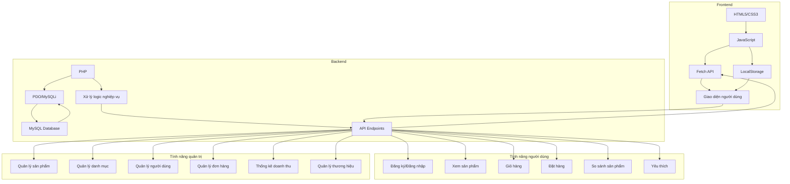

# Website Bán Đồ Gia Dụng

Đây là một website bán đồ gia dụng được xây dựng bằng PHP thuần và MySQL, với phiên bản web tĩnh để demo trên GitHub Pages.

## Công nghệ sử dụng

### Backend
- **PHP**: Xử lý logic nghiệp vụ và tương tác với cơ sở dữ liệu
- **MySQL**: Cơ sở dữ liệu lưu trữ thông tin sản phẩm, người dùng, đơn hàng
- **PDO/MySQLi**: Kết nối và truy vấn cơ sở dữ liệu

### Frontend
- **HTML5/CSS3**: Xây dựng giao diện người dùng
- **JavaScript**: Xử lý tương tác người dùng và tương tác với backend
- **AJAX/Fetch API**: Giao tiếp bất đồng bộ với server
- **LocalStorage**: Lưu trữ dữ liệu tạm thời ở phía client (phiên bản web tĩnh)

### Công cụ phát triển
- **Git**: Quản lý mã nguồn
- **GitHub Pages**: Triển khai phiên bản web tĩnh

## Kiến trúc dự án



## Tính năng chính

### Người dùng
- **Đăng ký/Đăng nhập**: Quản lý tài khoản người dùng
- **Xem sản phẩm**: Duyệt và tìm kiếm sản phẩm theo danh mục
- **Chi tiết sản phẩm**: Xem thông tin chi tiết, hình ảnh, đánh giá
- **Giỏ hàng**: Thêm, cập nhật, xóa sản phẩm trong giỏ hàng
- **Đặt hàng**: Tạo đơn hàng từ giỏ hàng
- **So sánh sản phẩm**: So sánh thông tin giữa các sản phẩm
- **Yêu thích**: Lưu sản phẩm yêu thích

### Quản trị viên
- **Quản lý sản phẩm**: Thêm, sửa, xóa sản phẩm
- **Quản lý danh mục**: Quản lý các danh mục sản phẩm
- **Quản lý người dùng**: Xem và quản lý tài khoản người dùng
- **Quản lý đơn hàng**: Xem và cập nhật trạng thái đơn hàng
- **Thống kê doanh thu**: Xem báo cáo doanh thu theo thời gian
- **Quản lý thương hiệu**: Thêm, sửa, xóa thương hiệu sản phẩm

## Cấu trúc thư mục dự án

```
BanDoGiaDung/
├── admin/           # Trang quản trị
├── assets/          # Tài nguyên (images, fonts)
├── database/        # File kết nối và xử lý database
├── frontend/        # Giao diện người dùng
│   ├── components/  # Các component tái sử dụng
│   ├── css/        # File CSS
│   └── js/         # File JavaScript
└── static-version/  # Phiên bản web tĩnh để demo
```

## Cài đặt phiên bản Localhost

1. Clone repository về máy local
2. Import file database vào MySQL
3. Cấu hình kết nối database trong file `database/connect.php`
4. Chạy website thông qua web server (Apache/Nginx)

### Yêu cầu hệ thống

- PHP >= 7.0
- MySQL >= 5.7
- Web server (Apache/Nginx)

## Phiên bản Web Tĩnh (Demo)

Phiên bản web tĩnh được tạo để demo trên GitHub Pages, sử dụng HTML, CSS và JavaScript thuần. Dữ liệu sản phẩm được lưu dưới dạng JSON và các chức năng như giỏ hàng, đăng ký/đăng nhập được xử lý ở phía client bằng localStorage.

### Cấu trúc thư mục phiên bản web tĩnh

```
static-version/
├── assets/          # Chứa hình ảnh và font chữ
├── css/             # Các file CSS
├── js/              # Các file JavaScript
├── data/            # Dữ liệu JSON
├── index.html       # Trang chủ
├── cart.html        # Trang giỏ hàng
└── account.html     # Trang tài khoản
```

### Cách sử dụng phiên bản web tĩnh

1. Truy cập trực tiếp vào thư mục `static-version`
2. Mở file `index.html` để xem demo
3. Hoặc deploy lên GitHub Pages để có URL trực tuyến

## Triển khai

### Phiên bản Localhost
1. **Shared Hosting**: Phù hợp với các gói hosting hỗ trợ PHP và MySQL
2. **VPS/Cloud Server**: Có thể triển khai trên các dịch vụ như DigitalOcean, Linode, Vultr
3. **Local Server**: Có thể chạy trên XAMPP, WAMP, MAMP

### Phiên bản Web Tĩnh
- Deploy lên GitHub Pages để có URL demo trực tuyến

## Đóng góp

Mọi đóng góp đều được hoan nghênh. Vui lòng tạo issue hoặc pull request để đóng góp.

## Giấy phép

MIT License 